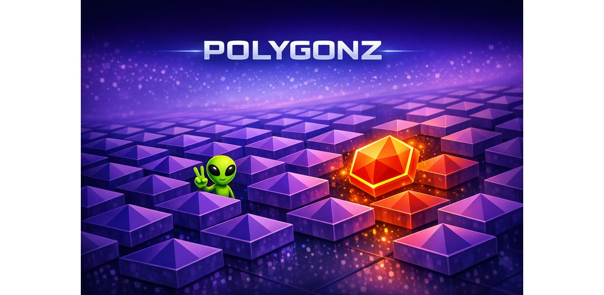
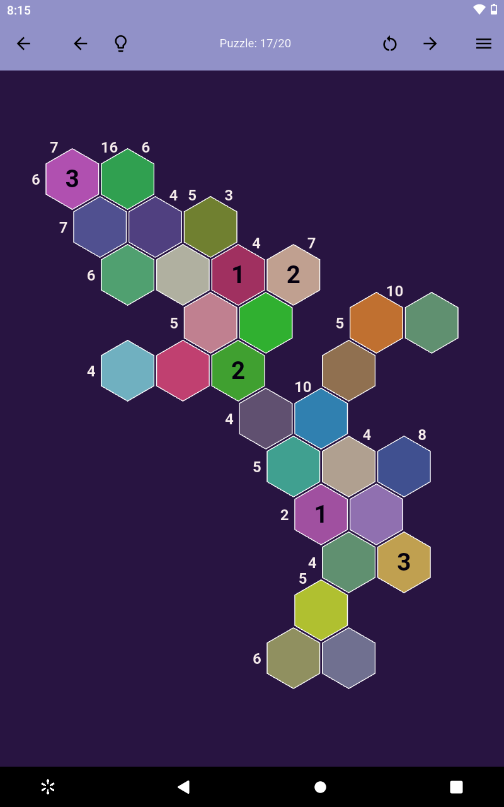
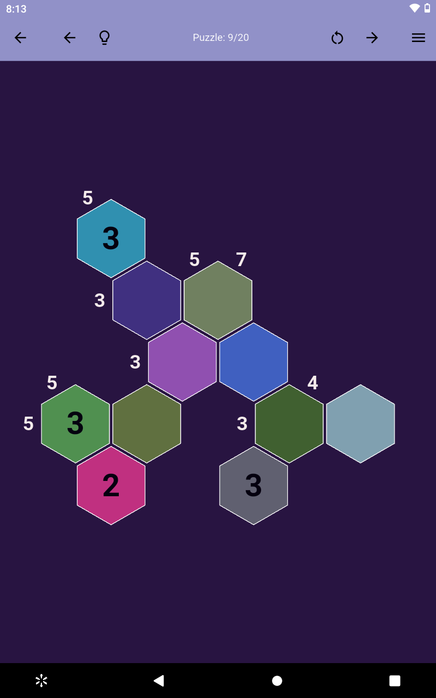

# Polygonz

A full featured brain training / logic game by FritzTudios
inspired by Sudoku and Minesweeper.

Fast, clean gameplay. No ads. No clutter. Just flow.

## 🎮 About the Game
Polygonz is a fast, minimalist geometry game built with Flutter.  
Simple controls, clean visuals, and a smooth difficulty curve make it easy to pick up and hard to put down.

## ✨ Features
- Minimalist geometric design  
- Satisfying progression curve  
- Offline play  
- No ads  

## 🔗 Links

- **Google Play:** https://play.google.com/store/apps/details?id=com.FritzTudios.polygonz_app

- **Privacy Policy:** https://fritztudios.github.io/polygonz-privacy/

- **Support:** fritztudios at gmail dot com

## 📸 QR Codes

- **FritzTudios**

- **Polygonz**

## 📸 Screenshots

## © 2026 FritzTudios
